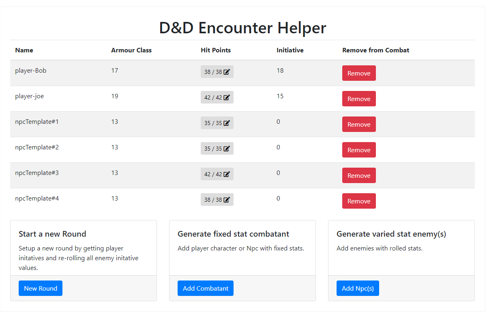
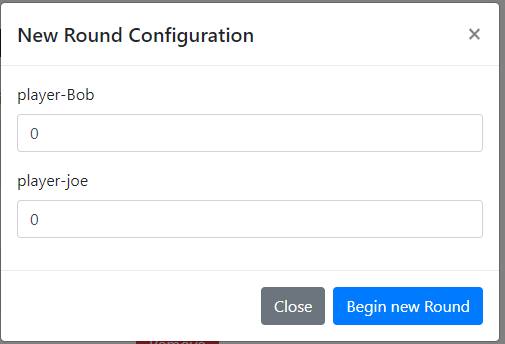
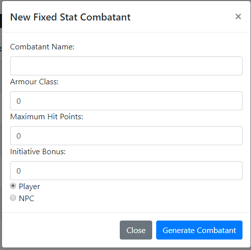
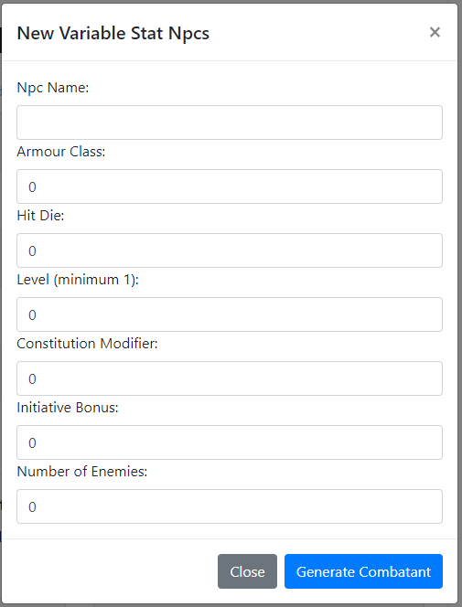

# D&D Encounter Helper

This is a tool designed to make managing many characters in combat much easier for a Dungeon Master.
Custom features of this tool include managing new initiatives rolls for each round, adding new
characters to combat, and adding many npcs to combat with a template system all at once.

<p align="center">
  
</p>

### Feature Highlights
- Quick stat dispaly for characters and NPCs with useful information sorted by current initiative: Name, Armour Class, Remaining and Max HP.
- New Round initative manager for collecting player initatives and automatically rolling npc initatives
- Character addition tool for adding a Player or NPC to the combat
- Enemy Template system for adding 1 or more enemies with rolled stats rather than a single fixed hp


### Usage

The main page is an initiative sorted cheat sheet of player and npc stats with a simple inline hp editor
<p align="center">
  
</p>

The bottom left card is a modal for starting a new round by collecting the player intitatives then rolling the npc initatives
<p align="center">
  
</p>

The bottom center card is a modal for creating a new player or npc with a fixed stat block
<p align="center">
  
</p>

The bottom right card is a modal for creating npc(s) with variable stat templates that will be rolled
<p align="center">
  
</p>

### Running Locally

You will need to have Java installed the download link can be found here:
[Java](http://www.oracle.com/technetwork/java/javase/downloads/java-archive-javase9-3934878.html)

You will also need your environment variables configured
[Java Environment variables](https://confluence.atlassian.com/doc/setting-the-java_home-variable-in-windows-8895.html)

Then open a command prompt into the project directory and run:
```java
mvnw spring-boot:run
```

Finally open your web browser and navigate to: `localhost:8080`
